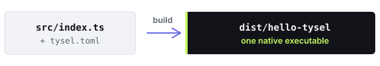

<p align="center">
  <picture>
    <source media="(prefers-color-scheme: dark)" srcset="brand/logo/tysel-wordmark-white.svg">
    
  </picture>
</p>

<p align="center">
  <strong>Write TypeScript. Ship a binary.</strong>
</p>

<p align="center">
  A native TypeScript runtime for services and durable agents.<br>
  Deploy one capability-bounded executable—without Node.js, V8, or
  <code>node_modules</code> in production.
</p>

<p align="center">
  <a href="docs/getting-started.md">Get started</a> ·
  <a href="docs/guides/examples.md">Examples</a> ·
  <a href="docs/index.md">Documentation</a> ·
  <a href="docs/security/README.md">Security</a>
</p>

<p align="center">
  
</p>

## Why Tysel

- **Ship one artifact.** Package your application and its native runtime as one
  executable.
- **Bound every capability.** Network, secrets, databases, and files are denied
  until explicitly granted.
- **Resume durable work.** Persist steps, effects, sleep, retry, and signals so
  work can continue after a process restart.

Tysel is Web-API-first and designed for HTTP services, workers, MCP tools,
isolated plugins, and durable agents. Experimental Wasm Component tasks let
bounded Rust or Go code use the same task model.

## Quick start

Install the latest published release on Linux or macOS:

```sh
curl -fsSL https://tysel.dev/install.sh | sh
tysel doctor --install
```

Create, verify, and run an HTTP service:

```sh
tysel init hello-tysel --yes
cd hello-tysel
tysel task verify
tysel dev
```

In another terminal, call the address printed by the server:

```sh
curl http://127.0.0.1:3000/hello
```

Stop the development server with `Ctrl-C`, then package and run it:

```sh
tysel task release
./dist/hello-tysel
```

The developer installation contains three cooperating tools. The application
artifact is still one executable. See [installation](docs/install.md) for
version pinning, authenticated upgrades, rollback, and Windows via WSL.

## Where Tysel fits

| Choose Tysel when you need | Know this before adopting |
| --- | --- |
| One executable instead of a JavaScript environment | Builds target the host or a verified Linux/macOS x64/arm64 runtime |
| Web-standard APIs for services and tasks | Tysel is not a general Node.js compatibility layer |
| Explicit host-resource grants | Native addons, subprocesses, and dynamic libraries are outside the contract |
| Durable work that survives restarts | Linux is the production isolation target |

Run [`tysel compat`](docs/compatibility/README.md) before adopting an npm
dependency. Choose Node.js, Bun, or Deno instead when broad Node.js compatibility
or a general-purpose JavaScript toolchain is the primary requirement.

## What you can build

- **Fetch-style HTTP service** — [Hello service](examples/hello-service)
- **Hono API** — [Hono API](examples/hono-api)
- **Cron and Queue worker** — [Task worker](examples/task-worker)
- **Durable LLM workflow** — [Durable agent](examples/durable-agent)
- **MCP tool with a brokered secret** — [MCP tool](examples/mcp-tool)
- **Isolated third-party code** — [Isolated plugin](examples/isolated-plugin)
- **Rust or Go Wasm task** — [Wasm Component guides](docs/reference/component/index.md)

Browse the complete [example gallery](docs/guides/examples.md) for filesystem,
SQLite, PostgreSQL, Redis, WebSocket, and LLM integrations.

## Security and evidence

Evaluate Tysel through its [security model](docs/security/README.md),
[capability matrix](docs/capabilities/README.md),
[performance evidence](docs/performance/README.md), and
[production runbook](docs/operations/production.md). Quantitative claims are
published only with a named release, environment, workload, and reproduction
command.

## Platform and stability

| Area | Current contract |
| --- | --- |
| API stability | Pre-1.0; APIs may change between minor releases |
| Toolchain | Linux and macOS, x64 and arm64 |
| Windows | WSL; no native Windows archive yet |
| `service` profile | Trusted first-party application code |
| `isolated` profile | Separate worker process; Linux is the production security gate |
| `component` profile | Experimental Wasm Component tasks with restricted WASI |
| Native runtime cross-compilation | Not provided; `build --target` instead packages with a verified same-version official runtime |

See [execution profiles](docs/concepts/execution-profiles.md) and
[how Tysel works](docs/concepts/how-tysel-works.md) for the complete runtime
model.

## Contributing

Issues and focused pull requests are welcome. CI validates formatting, tests,
compatibility, supply-chain checks, and release evidence. Do not report
vulnerabilities in a public issue; follow the
[security reporting guidance](docs/security/README.md#reporting-vulnerabilities).

## License

[Apache-2.0](LICENSE)
